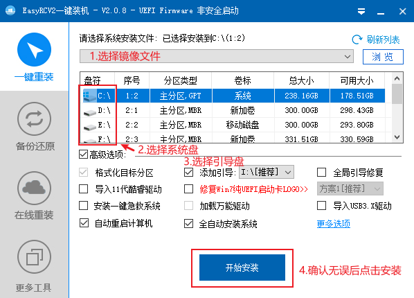
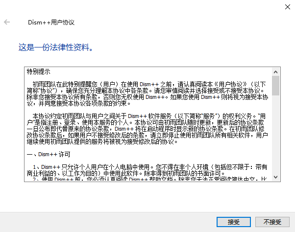
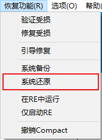
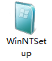
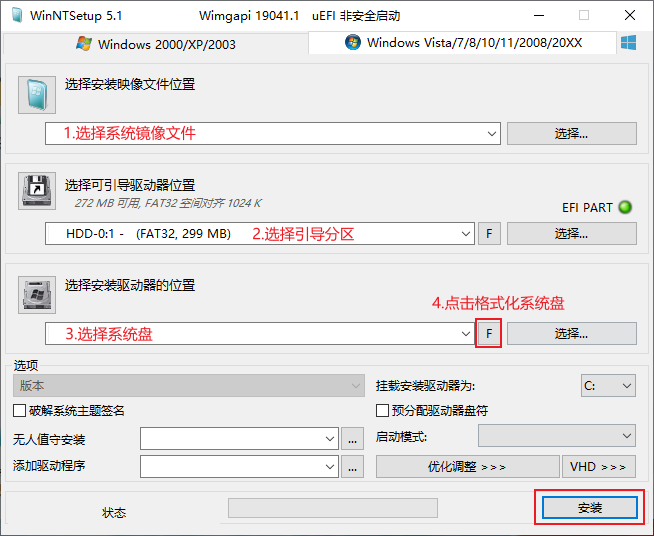
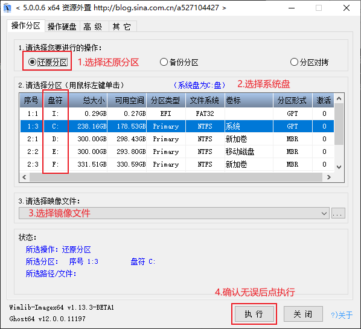

# 安装器方法安装 Windows

_本篇教程将详细介绍使用 U 盘启动盘中的第三方 windows 安装器安装微软原版系统的具体方法流程、注意事项、异常问题解决等。_

_第三方的 Windows 安装器利用了与微软原版 Windows 安装程序一样的原理，直接将系统中的文件，解压到硬盘上，实现最终的安装。 该方式的特点是：安装系统和 PE 的启动类型、PE 的位数无关，以任何方式启动的 WinPE，均能将系统安装至任意分区表类型的硬盘上。_

_本方法支持的系统：Windows 7，Windows 8.1，Windows 10 等 NT6 系列的全部系统。甚至支持安装 WindowsXP。_

## EasyRC

1. 进入 WinPE 后，打开 EasyRC 备份还原工具；  
   
2. 打开后进行如下操作；  
   
3. 确认无误后点击”确定“按钮；
4. 耐心等待系统镜像还原，一般需要 5-15 分钟左右的时间。
5. 完成后拔下 U 盘，重启电脑。

## DISM++

1. 进入 WinPE 后，打开 DISM++ 工具；
   <!--  -->
2. 打开后会提示用户协议，点击“接受”按钮
   
3. 在左下角菜单中选择“恢复功能”-“系统还原”  
   
4. 点击进入“系统还原”功能后进行如下操作：  
   
5. 确认无误后点击”确定“按钮，将询问修复方式，没有异议或看不懂点击”确定“
6. 耐心等待系统镜像还原，一般需要 5-15 分钟左右的时间。
7. 完成后拔下 U 盘，重启电脑。

## WinNTSetup

1. 进入 WinPE 后，打开 WinNTSetup 备份还原工具；  
   
2. 打开后进行如下操作；  
   
3. 确认无误后点击”确定“按钮；
4. 耐心等待系统镜像还原，一般需要 5-15 分钟左右的时间。
5. 完成后拔下 U 盘，重启电脑。

## CGI

1. 进入 WinPE 后，打开 CGI 备份还原工具；  
   
2. 打开后进行如下操作；  
   
3. 确认无误后点击”确定“按钮；
4. 耐心等待系统镜像还原，一般需要 5-15 分钟左右的时间。
5. 完成后拔下 U 盘，重启电脑。
