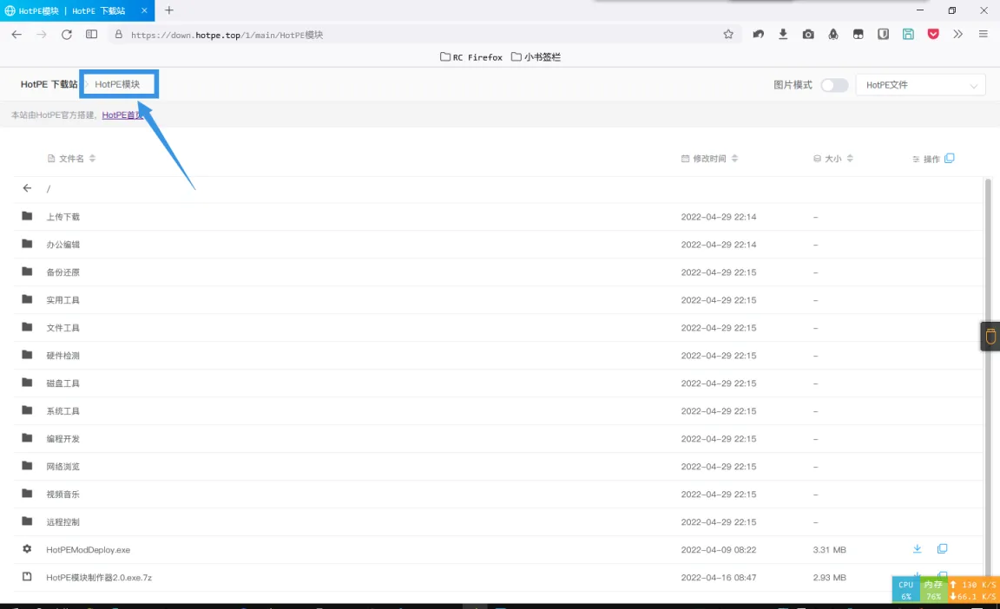
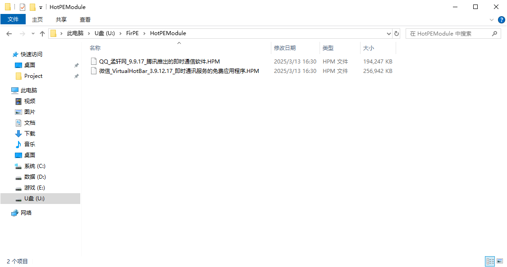

# HotPEModule 插件

## 介绍和生态

HPM(HotPE Module)是一种程序打包格式，最初用于 HotPE 中以实现模块化。现已扩展到其他 PE 或桌面系统，提供简明的包管理功能。拥有类似绿软对系统低入侵优点(相对于传统软件安装方式残留少)。

## 如何下载 HPM 模块？

打开 [HotPE](https://www.hotpe.top/) 官网，在下载页面选择“访问下载站”，在下载站中打开“HotPE 模块”文件夹进行下载模块

## 如何加载 HotPE 模块？

### 自动加载

将模块文件放到 FirPE 安装磁盘下的 HotPEModule 文件夹，实现进入 PE 时自动加载

### 手动加载

- 在 FirPE 中双击打开模块文件进行加载
- 使用命令行加载：`hpm_cli.exe -i 模块路径`
