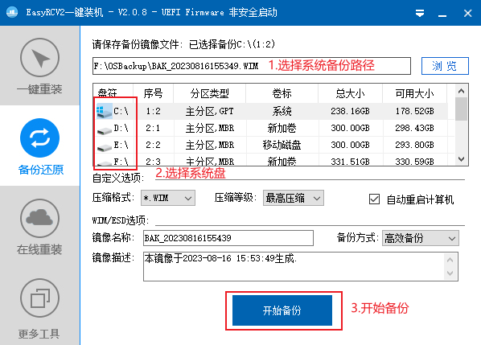
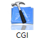
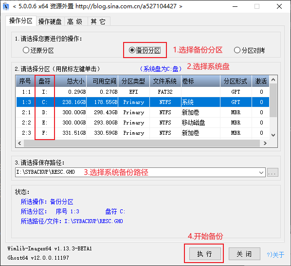

# 系统备份

_本篇教程将详细介绍使用 U 盘启动盘中的第三方工具备份系统的具体方法流程、注意事项、异常问题解决等。_

_第三方工具备份原理是将系统中的文件，打包到镜像文件，最终实现系统备份。_

## EasyRC

1. 进入 WinPE 后，打开 EasyRC 备份还原工具；  

2. 打开后进行如下操作；  

3. 耐心等待系统备份完成

## DISM++
1. 进入 WinPE 后，打开 DISM++ 工具；  

2. 打开后会提示用户协议，点击“接受”按钮 

3. 在左下角菜单中选择“恢复功能”-“系统备份”  

4. 选择系统备份路径后点击“确定按钮”

5. 耐心等待系统备份完成

## CGI

1. 进入 WinPE 后，打开 CGI 备份还原工具；  

2. 打开后进行如下操作；  

3. 耐心等待系统备份完成

## 恢复系统

**参考[安装器安装Windows](/installOS/installTool.md)**
