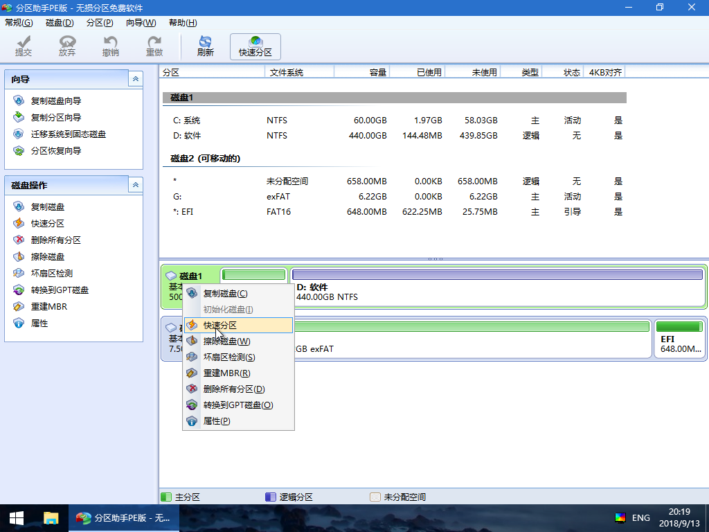
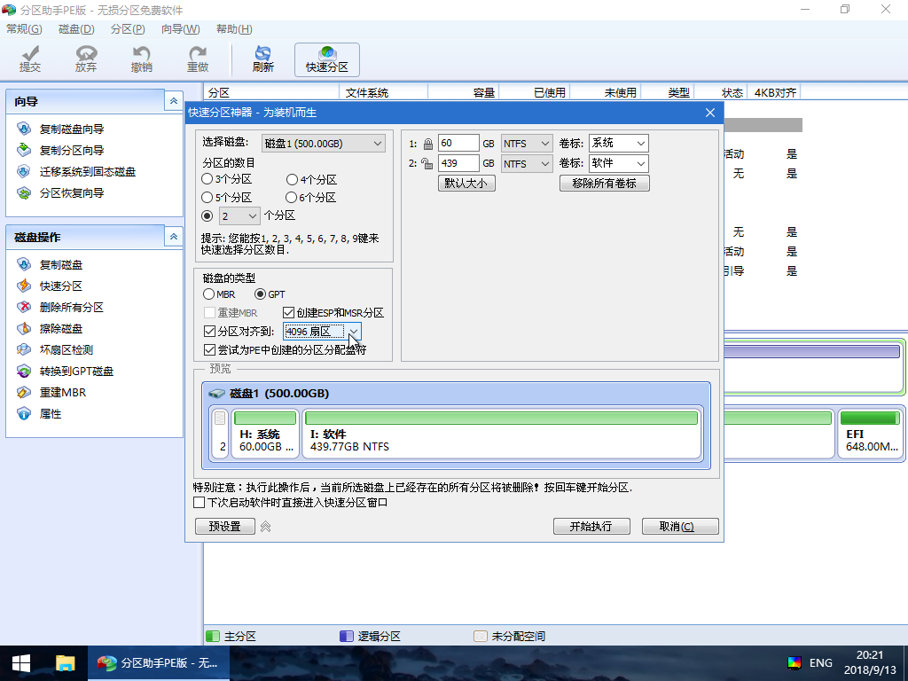

# 硬盘快速分区教程

_本篇教程将详细介绍使用 U 盘启动盘对硬盘进行完全格式化重新分区的具体方法流程、注意事项等。_

_本方法支持的分区的格式为：GPT MBR_

## 硬盘分区的特别提示

- 本分区教程会完全格式化硬盘
- 本分区方法可以将分区重新分为 GPT 或 MBR。
- 在分区操作之前，请务必做好数据备份。

## 使用 Diskgenius

## 使用分区助手

打开 WinPE 桌面上的“分区助手(无损)”。您会看到当前硬盘的列表。

对着需要分区的硬盘点右键，选择快速分区。

在弹出的快速分区窗口中选择需要分区的个数、分区表类型 GPT 或者 MBR、4K 对齐等，然后点击开始执行。

::: warning 注意
如果您需要使用 UEFI 启动系统，这里必须选择 GPT 分区表，如果使用 Legacy 方式启动电脑，这里必须选择 MBR。
:::

等待执行完成之后，分区操作完毕。
