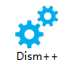
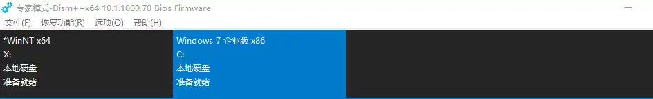
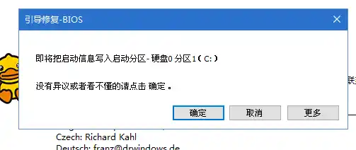

# 修复系统引导

1. 进入WinPE系统
2. 找到“Dism++”应用并双击打开

    
3. 然后在菜单栏下方**选择需要修复引导的系统**

    

4. 点击菜单栏上的“恢复功能”，选择“引导修复”。

    接下来可能会询问修复引导方式

    

    没有异议或者看不懂的话请点击 确定 ，稍等片刻将会弹出引导修复结果。

5. 完成后请拔下U盘并且重启电脑。当看到熟悉的壁纸和桌面图标时，证明引导已经修复成功。
