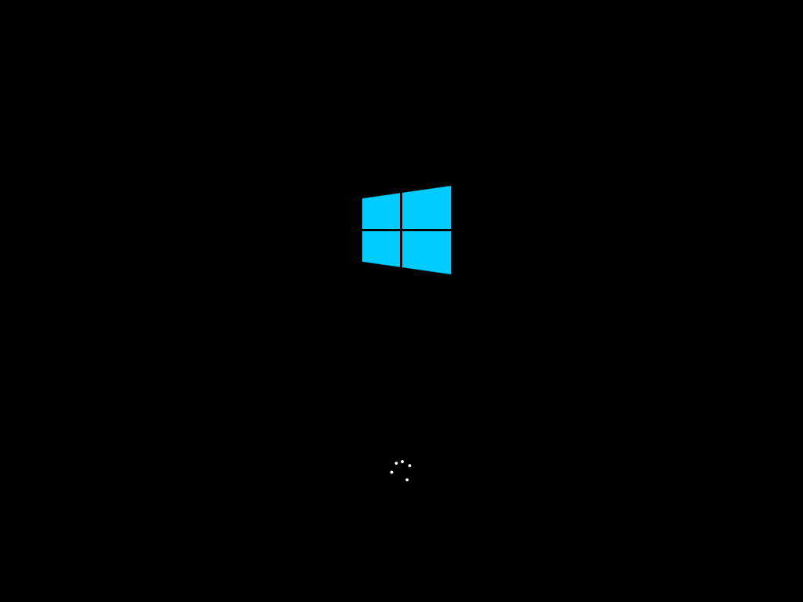

# 如何进入 PE 系统

无论您是想装系统、拯救文件还是破解密码等，您要做的第一步就是从 U 盘启动进入 PE 系统。

::: tip 启动 PE 系统的关键操作顺序：

1. 在开机时进入主板的启动项列表；
2. 找到要启动的 U 盘，并辨别 UEFI 和 Legeacy 方式；
3. 选择一个合适的 WinPE 系统版本进入。

:::

## 第一步：在开机时进入主板的启动项列表

请将电脑关机，将 FirPE 启动盘插入到电脑后开机。然后在开机后的几秒内，当出现开机画面，按下快捷启动热键 `F12`（不同机型请查看下面快捷键列表）进入启动项列表，然后在列表中通过方向键选择 U 盘所在选项，一般会带 USB 字样或者是 U 盘的品牌名（Sandisk、Toshiba 之类），然后敲击回车可以进入 U 盘的 PE 菜单选择界面。

以下为各种品牌的主板和笔记本的快捷启动按键：

<table>
  <tbody>
    <tr>
      <td colspan="2" style="text-align: center">组装机主板</td>
      <td colspan="2" style="text-align: center">品牌电脑</td>
    </tr>
    <tr>
      <td style="text-align: center">主板品牌</td>
      <td style="text-align: center">启动按键</td>
      <td style="text-align: center">电脑品牌</td>
      <td style="text-align: center">启动按键</td>
    </tr>
    <tr>
      <td style="text-align: center">华硕主板</td>
      <td style="text-align: center">F8</td>
      <td style="text-align: center">联想电脑</td>
      <td style="text-align: center">F12</td>
    </tr>
    <tr>
      <td style="text-align: center">技嘉主板</td>
      <td style="text-align: center">F12</td>
      <td style="text-align: center">宏基电脑</td>
      <td style="text-align: center">F12</td>
    </tr>
    <tr>
      <td style="text-align: center">微星主板</td>
      <td style="text-align: center">F11</td>
      <td style="text-align: center">华硕电脑</td>
      <td style="text-align: center">ESC或F8</td>
    </tr>
    <tr>
      <td style="text-align: center">映泰主板</td>
      <td style="text-align: center">F9</td>
      <td style="text-align: center">惠普电脑</td>
      <td style="text-align: center">F9或F12</td>
    </tr>
    <tr>
      <td style="text-align: center">梅捷主板</td>
      <td style="text-align: center">ESC或F12</td>
      <td style="text-align: center">联想Thinkpad</td>
      <td style="text-align: center">F12</td>
    </tr>
    <tr>
      <td style="text-align: center">七彩虹主板</td>
      <td style="text-align: center">ESC或F11</td>
      <td style="text-align: center">戴尔电脑</td>
      <td style="text-align: center">F12或ESC</td>
    </tr>
    <tr>
      <td style="text-align: center">华擎主板</td>
      <td style="text-align: center">F11</td>
      <td style="text-align: center">神舟电脑</td>
      <td style="text-align: center">F12</td>
    </tr>
    <tr>
      <td style="text-align: center">斯巴达克主板</td>
      <td style="text-align: center">ESC</td>
      <td style="text-align: center">东芝电脑</td>
      <td style="text-align: center">F12</td>
    </tr>
    <tr>
      <td style="text-align: center">昂达主板</td>
      <td style="text-align: center">F11</td>
      <td style="text-align: center">三星电脑</td>
      <td style="text-align: center">F12或F2</td>
    </tr>
    <tr>
      <td style="text-align: center">双敏主板</td>
      <td style="text-align: center">ESC</td>
      <td style="text-align: center">IBM电脑</td>
      <td style="text-align: center">F12</td>
    </tr>
    <tr>
      <td style="text-align: center">翔升主板</td>
      <td style="text-align: center">F10</td>
      <td style="text-align: center">富士通电脑</td>
      <td style="text-align: center">F12</td>
    </tr>
    <tr>
      <td style="text-align: center">精英主板</td>
      <td style="text-align: center">ESC或F11</td>
      <td style="text-align: center">海尔电脑</td>
      <td style="text-align: center">F12</td>
    </tr>
    <tr>
      <td style="text-align: center">冠盟主板</td>
      <td style="text-align: center">F11或F12</td>
      <td style="text-align: center">方正电脑</td>
      <td style="text-align: center">F12</td>
    </tr>
    <tr>
      <td style="text-align: center">富士康主板</td>
      <td style="text-align: center">ESC或F12</td>
      <td style="text-align: center">清华同方电脑</td>
      <td style="text-align: center">F12</td>
    </tr>
    <tr>
      <td style="text-align: center">顶星主板</td>
      <td style="text-align: center">F11或F12</td>
      <td style="text-align: center">微星电脑</td>
      <td style="text-align: center">F11</td>
    </tr>
    <tr>
      <td style="text-align: center">铭瑄主板</td>
      <td style="text-align: center">ESC或F11</td>
      <td style="text-align: center">明基电脑</td>
      <td style="text-align: center">F9或F8</td>
    </tr>
    <tr>
      <td style="text-align: center">盈通主板</td>
      <td style="text-align: center">F8</td>
      <td style="text-align: center">技嘉电脑</td>
      <td style="text-align: center">F12</td>
    </tr>
    <tr>
      <td style="text-align: center">捷波主板</td>
      <td style="text-align: center">ESC</td>
      <td style="text-align: center">Gateway电脑</td>
      <td style="text-align: center">F12</td>
    </tr>
    <tr>
      <td style="text-align: center">Intel主板</td>
      <td style="text-align: center">F12</td>
      <td style="text-align: center">eMachines电脑</td>
      <td style="text-align: center">F12</td>
    </tr>
    <tr>
      <td style="text-align: center">杰微主板</td>
      <td style="text-align: center">ESC或F8</td>
      <td style="text-align: center">索尼电脑</td>
      <td style="text-align: center">ESC</td>
    </tr>
    <tr>
      <td style="text-align: center">致铭主板</td>
      <td style="text-align: center">F12</td>
      <td style="text-align: center">苹果电脑</td>
      <td style="text-align: center">长按“option”键</td>
    </tr>
    <tr>
      <td style="text-align: center">磐英主板</td>
      <td style="text-align: center">ESC</td>
      <td style="text-align: center">​</td>
      <td style="text-align: center">​</td>
    </tr>
    <tr>
      <td style="text-align: center">磐正主板</td>
      <td style="text-align: center">ESC</td>
      <td style="text-align: center">​</td>
      <td style="text-align: center">​</td>
    </tr>
    <tr>
      <td style="text-align: center">冠铭主板</td>
      <td style="text-align: center">F9</td>
      <td style="text-align: center">​</td>
      <td style="text-align: center">​</td>
    </tr>
    <tr>
      <td colspan="4" style="text-align: center">
        注意：其它机型请尝试或参考以上品牌常用启动热键
      </td>
    </tr>
  </tbody>
</table>

_另外您还可以在 BIOS 设置中，将 U 盘设置为第一启动项启动 U 盘，具体方法可以百度。_

## 第二步：找到要启动的 U 盘，并辨别 UEFI 和 Legeacy 方式

FirPE 启动盘支持两种启动方式：

- UEFI
- Legacy

**当您的机器支持 UEFI 的话（新机器一般同时支持 Legacy 和 UEFI），在这个启动项中一般会出现两个 U 盘的选项，一个是 UEFI 开头的，另一个是不带 UEFI 开头的或叫 Legacy 的：**

**当您的机器（老机器）只支持 Legacy 时，在这个主板的启动项中就只会出现一个 U 盘的选项：**

UEFI/Legacy 启动方式的选择，对后续安装系统的时候影响比较大，一般情况下，如果需要用 EFI 方法安装系统（硬盘分区表为 GPT），就启动 UEFI 的 PE。如果用传统方式安装系统（硬盘分区表为 MBR），就 Legacy 启动方式启动 PE，这个按照您自己的需求选择。如果不清楚的话可随意先进一个，如果后面遇到问题再回来重选即可。如果是只支持 Legacy 启动的老机器，那就没得选，只能以 Legacy 方式启动 PE。

::: warning 注意
一些新机器默认了只开通了 UEFI 启动，如果需要打开 Legacy 启动，需要进 BIOS 设置中关闭 SecureBoot。
:::

选中需要启动的 U 盘选项，继续敲回车之后，均会先进入 PE 版本选择界面。但以不同的方式进入，显示的 PE 选择界面是不同的。

::: tip 提示
Legacy 启动时，PE 选择菜单为图片背景。UEFI 启动时，PE 选择菜单为黑色纯色背景。
:::

## 第三步：选择一个合适的 WinPE 系统版本进入

FirPE 启动盘支持多个 WinPE 系统，在引导选择界面可以按需选择，选中后，敲击回车正式进入 WinPE 系统。

如果您能成功进入到这个 WinPE 桌面，并且知道自己进入的是 legacy 方式的 PE，还是 UEFI 方式的 PE（通过在 WinPE 版本选择菜单页中背景是蓝色/黑色确定），就完成第一步。虽然现在看起来只完成了一小步，但这是迈向成功的一大步。
