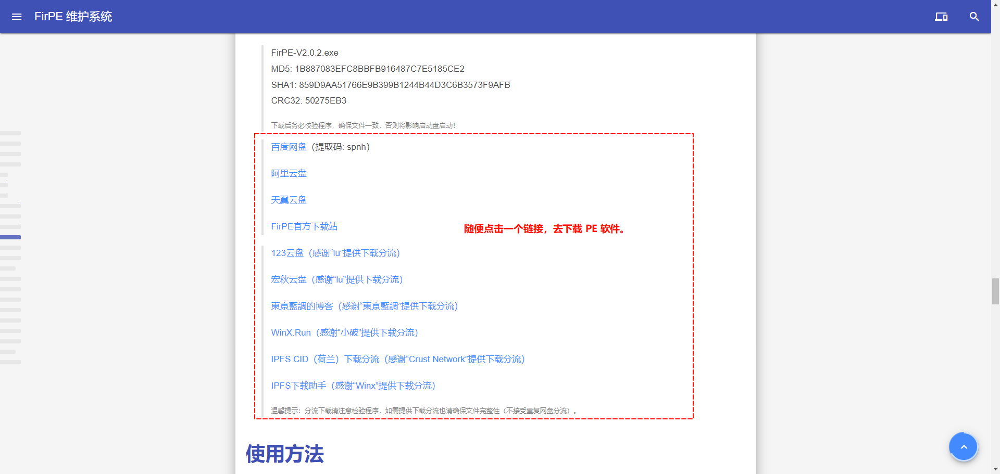
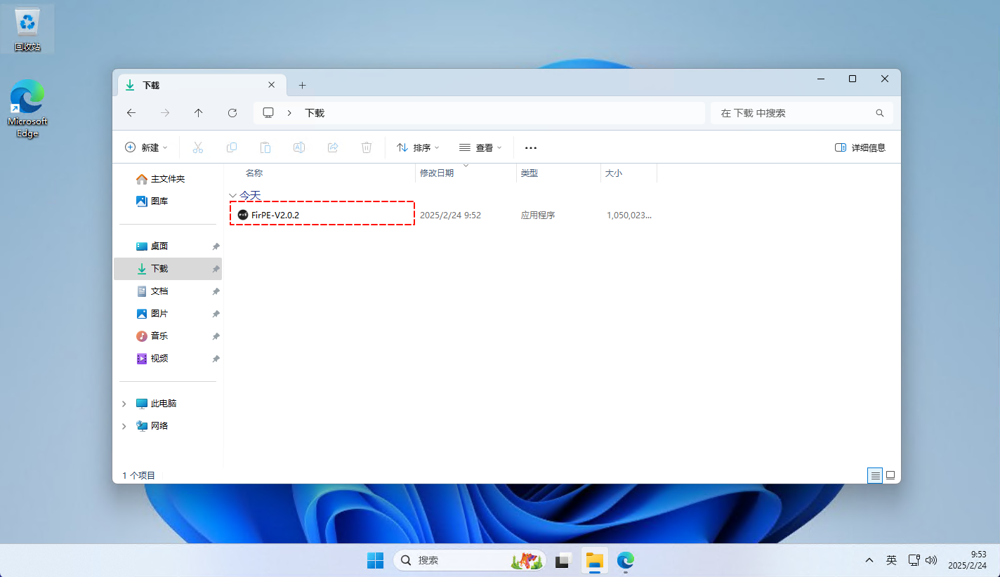
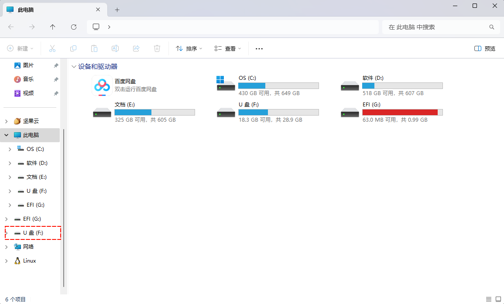
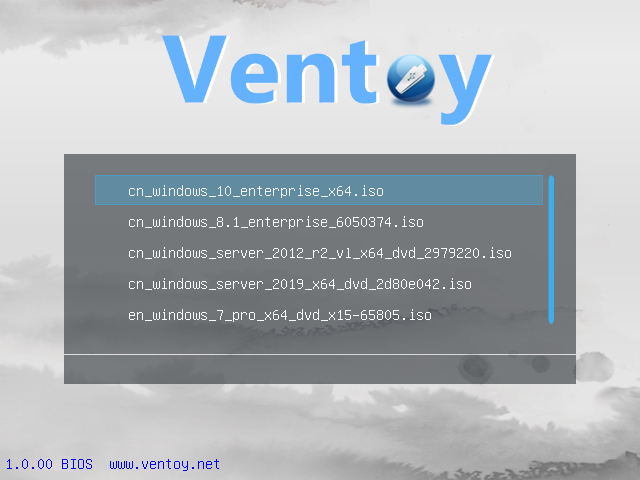

# 快速开始

## 制作 U 盘启动盘

通常使用 U 盘来作为 WinPE 启动介质：

1. U 盘容量大，既能存储 WinPE 又能存储多个 Windows 系统镜像，方便选择和切换；
2. U 盘速度快，可以缩短 WinPE 的启动时间和 Windows 系统的安装时间。
3. U 盘便携，可以随身携带，适用于多台电脑。

::: tip 提示
读卡器配合内存卡、MP3/MP4/MP5、相机、老人机等这些非标准的设备也可以作为启动盘介质，但是会降低启动盘的稳定性，甚至会损害设备的正常功能，因此不建议在没有必要的情况下使用。
:::

::: warning 注意
使用质量低劣/仿冒的 U 盘制作 U 盘启动盘，制作成功率和启动稳定性将会大幅降低。
:::

### 通过 FirPE 安装包制作启动盘

1. 打开 [FirPE 官网](https://www.firpe.cn)
   
2. 下载 [FirPE](https://www.firpe.cn) 安装包；
   
3. 关闭杀毒软件避免在制作时造成影响（重要），运行 FirPE 安装包；
   
4. 将 U 盘插入到 USB 接口（如台式机请插至背后接口或 USB3.0 接口）；
   
5. 备份 U 盘资料（**注意：制作 U 盘启动盘将会清除 U 盘所有数据**）；
6. 点击“全新制作”按钮，进入 U 盘启动盘制作环节；
   
7. 等待 U 盘启动盘制作完成，该过程应 U 盘读写速度而异，一般在 5 分钟以内；

#### 分区格式

- **FAT32**  
  FAT32 是一种较老的文件系统，具有高度的兼容性，可以在多种操作系统和设备上使用。但是它也有一些限制，如**单个文件最大只能为 4GB**，单个分区最大只能为 32GB（Windows 限制）。它也不支持一些高级功能，如文件压缩、加密和权限管理。
- **exFAT**  
  exFAT 是一种针对闪存设备优化的文件系统，是 FAT32 的替代品。它可以突破 FAT32 的文件大小和分区大小的限制，同时也保持了良好的兼容性，可以在 Windows 和 Mac 系统上使用。但是它没有日志功能，因此在意外断电等情况下可能会损坏文件系统。它也不支持文件压缩、加密和权限管理等高级功能。
- **NTFS**  
  NTFS 是 Windows 系统的默认选择。它具有高效和安全的特点，可以支持大于 4GB 的单个文件和大于 32GB 的单个分区。它也支持一些高级功能，如文件压缩、加密、权限管理和日志记录。但是它的兼容性较差，在 Mac 系统上只能读取不能写入，在一些游戏机等设备上也不能使用。

#### 写入模式

- **单分区写入模式**  
  单分区是将 WinPE 文件直接存放在用户数据分区中，用户数据分区可以被任意访问和修改，安全性较低，且由于 WinPE 启动要求 FAT32 文件系统，限制了用户数据分区的文件大小不能超过 4GB，因此该模式仅适用于 2GB 及以下容量的 U 盘。
- **双分区写入模式：数据区（存放数据） + EFI 分区（存放 WinPE 相关文件）**  
  双分区将用户数据分区和 WinPE 分区分别独立，用户数据分区可以存储大于 4GB 的文件，WinPE 分区可以保证启动 U 盘的兼容性和稳定性。
- **三分区写入模式：UD 引导区（存放 Legacy 引导文件） + 数据区（存放数据） + EFI 分区（存放 WinPE 相关文件）**  
  三分区是在双分区基础上额外创建了一个 UD 引导分区，它可以增强启动 U 盘在老式电脑（约十年前左右）上的适应性。但是随着技术的发展，这些电脑已经不适合人们的生活需求，也不再需要进行维护。另一方面，UD 分区也有一些缺点，如占用 U 盘空间、增加制作难度、降低读写速度等。因此三分区的意义也逐渐减弱，除非有特殊的需求。
- **Ventoy 官方模式：数据区 + Ventoy 区**  
  Ventoy 是一种启动盘开源工具。无需反复地格式化 U 盘，你只需要把 ISO/WIM/IMG/VHD(x)/EFI 等类型的文件直接拷贝到 U 盘里面就可以启动了，无需其他操作。Ventoy 会在启动时显示一个菜单来供你进行选择。
  

- **Ventoy 混合模式：数据区 + Ventoy 区 + EFI 区**  
  在 Ventoy 基础上增加 EFI 分区，兼具灵活性和兼容性。

### 通过 ISO 镜像 制作启动盘

通过 ISO 文件制作 U 盘启动盘的方法有很多，不同的工具和步骤可能会有所差异，但是大致的流程是：

1. 在 FirPE 安装包中生成 ISO 镜像；
2. 下载制作 U 盘启动盘的工具，如[Rufus](https://rufus.ie)、[UltraISO](https://ultraiso.net/ultraiso/)等，安装并运行；
3. 在工具中选择 U 盘作为目标设备，选择 ISO 文件作为源文件，选择合适的写入方式，如 MBR 或 GPT、BIOS 或 UEFI 等；
4. 点击开始或写入按钮，等待工具将 ISO 文件中的内容写入到 U 盘中，完成后就可以用 U 盘启动电脑。

### 通过 Ventoy 制作启动盘

[Ventoy](https://www.ventoy.net) 是一款开源的可启动 USB 驱动器制作工具。只需将 ISO 文件拷贝到 USB 驱动器中，即可启动。可以同时拷贝多个不同类型的 ISO 文件，Ventoy 将在启动时呈现一个菜单以供选择。Ventoy 兼容 Windows 和 Linux 的绝大多数发行版。Ventoy 还提供了丰富的插件和主题功能，能够定制启动界面和环境。

::: tip 提示
FirPE 的 ISO 镜像文件可在**FirPE 安装包中生成 ISO 至 Ventoy 启动盘**
:::

- [Ventoy 使用说明](https://www.ventoy.net/cn/doc_start.html)

## 生成 ISO 镜像进行刻录

FirPE 安装包采用内置集成 ISO 方式，ISO 镜像文件可在 FirPE 安装包内生成。通过 ISO 镜像可以将 WinPE 刻录到 U 盘、光盘等设备。

### 生成 ISO 镜像

1. 下载 [FirPE](https://www.firpe.cn) 安装包；
2. 关闭杀毒软件避免在生成时造成影响（重要），运行 FirPE 安装包；
3. 点击“生成 ISO”按钮，选择 ISO 镜像保存目录，进入 ISO 镜像生成环节；
4. ISO 镜像生成完成后即可使用。

## 本机系统安装 WinPE 工具箱

FirPE 支持为本机系统增加 WinPE 引导启动项，在电脑开机时将显示系统启动项。

### 开始安装

1. 下载 [FirPE](https://www.firpe.cn) 安装包；
2. 关闭杀毒软件避免在安装时造成影响（重要），运行 FirPE 安装包；
3. 点击“本地安装”按钮，进入本地安装 WinPE 环节；
4. 等待本地安装 WinPE 完成；
5. 本地安装 WinPE 完成，重启后在引导项菜单中即可看到 WinPE 启动项。

#### 常见问题

问: **能不能安装在其他盘使得重装后也能保留 WinPE？**  
答: 目前没有提供安装位置选项也无计划提供。因为 WinPE 系统安装在本地需要建立引导菜单，而重装后即便 WinPE 文件得到保留但 WinPE 的引导也依然会丢失。  
ps: 技术上是可行的，但对环境有要求，感兴趣的小伙伴可以自己折腾。

问: **本地安装后如何卸载？**  
答: 在“卸载或更改程序”界面中找到相关项目即可完成卸载。

## 手机启动 WinPE

::: warning 注意
本方法需要手机拥有 Root 权限，如何获取 Root 权限请自行学习（目前 VIVO/OPPO/华为手机均未开放 Root 权限）
:::

## 网络启动 WinPE

网络启动 WinPE 是指通过网络连接到一个服务端，从服务端上下载 WinPE 映像并在本地计算机上运行的过程。这样可以避免使用 U 盘或光盘等物理介质，方便在多台计算机上进行安装、部署或修复 Windows 操作系统。

要实现网络启动 WinPE，需要以下几个步骤：

1. 开启网络启动 WinPE 服务端：在 FirPE 安装包-菜单；
2. 在本地计算机上设置 BIOS 或 UEFI，开启网络启动开关；
3. 在本地计算机上启动时按下启动热键（通常是 F12），选择网络启动选项；
4. 等待 WinPE 映像文件从服务器下载并运行在本地计算机上。

网络启动 WinPE 的优点是可以快速、灵活、统一地进行 Windows 操作系统的安装或维护，节省时间和成本。缺点是需要一个稳定、高速的网络环境，以及一个配置好的服务端。

### 常见问题

问: **如何在 BIOS 中开启网络启动开关？**  
答: 重启电脑，并在开机时按制造商指定的键进入 BIOS 或 UEFI 的设置界面。常用的键有 Esc、Delete 等。 在设置界面中，找到与网络启动相关的选项，如 LAN Controller、PXE OPROM、Network Boot 等，并根据需要开启或关闭它们。一般来说，要开启网络启动，需要将 LAN Controller 和 PXE OPROM 都设置为 Enabled，然后将 Network Boot 或 Boot Option #1 设置为网卡。保存并退出设置界面。
