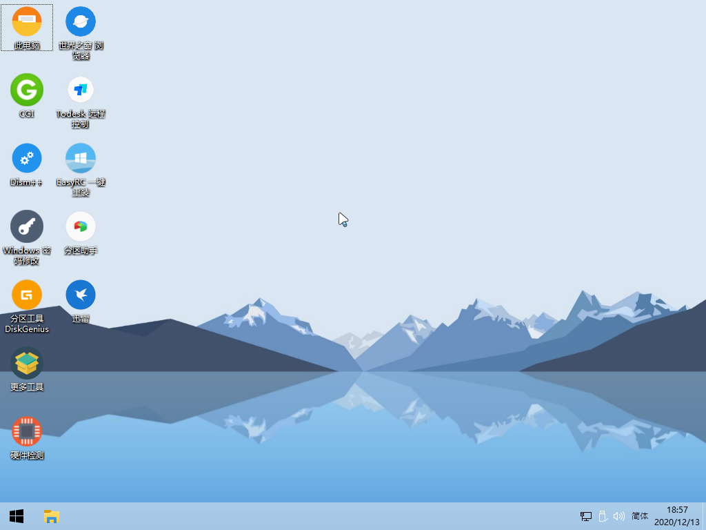

# FirPE 使用指南（必读）

在正式开始使用之前，请务必认真阅读以下关于 FirPE 启动盘的特别说明。

::: tip FirPE 启动盘是 PE 盘，而非可一键安装的系统盘
该 U 盘不是能够一键安装的系统安装盘，这点请特别注意。需要在开机时，选择从 U 盘启动进入，而不是在正常运行的系统下使用。通过 U 盘启动进入 PE 之后，如果要安装系统，需手工挂载 ISO 镜像，按照一定的流程安装。
:::

::: tip 搞清楚 UEFI 和 Legacy(俗称 BIOS)启动方式区别很重要
请务必了解 UEFI 和 Legacy(俗称 BIOS)启动方式的大概含义。因为现在市面上的很多新机型，都是 UEFI 和 Legacy 共存的。以不同的启动方式进入 PE 之后，看到的启动界面和后续的操作并不完全相同。当然如果您遇到的机器比较老，只有 Legacy 启动，就不存在这个问题。关于 UEFI 和 Legacy 启动方式的具体含义和区别可以自行查询学习。
:::

::: tip PE 是专业型装机维护工具，多些耐心多请教
使用 PE 进行装机维护，对操作方式和经验有较高的要求。特别在当今市面上不同年代机型特别多的情况下，装机时也许偶尔会遇到一些小障碍，但也别担心，多查查多问问总可以解决的。我们提供的操作流程和技巧是最忠于原生技术，并且很巧妙的。按照我们提供的步骤，基本上可以很轻松的把各种奇怪的情况避免掉，遇到问题也别着急多查查多问问总能解决。
:::
