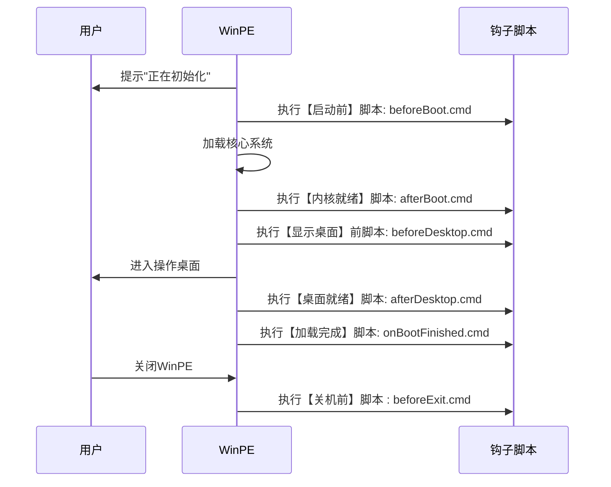

# 第一章、什么是 WinPE 的生命周期？

想象 WinPE 就像一位临时管家，从您启动电脑到关机离开，它会经历以下关键阶段：


生命周期钩子就是在这些阶段插入的"智能开关"，让您能在特定时机自动执行定制操作。

# 第二章、Hook 机制架构

本流程图展示了 WinPE 从启动到关闭过程中各阶段钩子脚本的触发顺序与交互逻辑：

> [!NOTE]
> 通过编写对应阶段的批处理脚本，可实现：开机自检 → 自动运维 → 离场清理 的完整自动化链路。



# 第三章、Hook 文件详解

## 执行阶段说明

|    **钩子文件**    |    **执行时机**     | **典型应用场景** | **执行方式** |
| :----------------: | :-----------------: | :--------------: | :----------: |
|   beforeBoot.cmd   | 启动加载器初始化前  |     修改壁纸     |   同步顺序   |
|   afterBoot.cmd    |   内核加载完成后    |  加载第三方驱动  |   同步顺序   |
| beforeDesktop.cmd  |  资源管理器启动前   | 设置临时环境变量 |   同步顺序   |
|  afterDesktop.cmd  |     桌面显示后      | 自动打开运维工具 |   异步并发   |
| onBootFinished.cmd |  所有服务启动完毕   |  执行自动化任务  |   异步并发   |
|   beforeExit.cmd   | 用户选择重启/关机前 | 备份数据到 U 盘  |   同步顺序   |

## 环境变量

```bat
:: 示例：获取系统路径
echo WinPE系统根目录：%SystemRoot%
echo U盘个性化目录（U盘:\FirPE`）：%USBDrive%
echo 程序目录: %ProgramFiles%
echo 程序目录（32位）: %ProgramFiles(x86)%
```

## 使用方法

1. 创建`U盘:\FirPE\Hooks`目录，根据需要创建对应的脚本文件。
2. 根据需要编写自定义脚本到对应的生命周期文件中。
3. 脚本将在相应的生命周期阶段被调用执行。

# 三、实战案例

## 案例：自动打开 EasyRC

```bat
:: afterDesktop.cmd
start "" "%ProgramFiles(x86)%\备份还原\EasyRC\EasyRCV3.exe"
```
