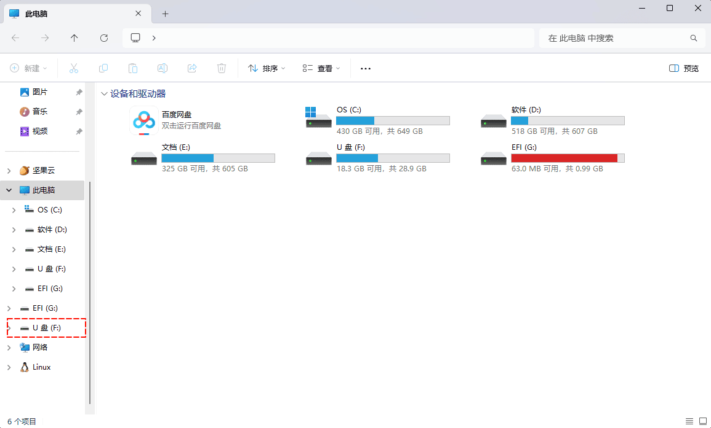
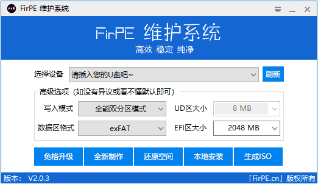
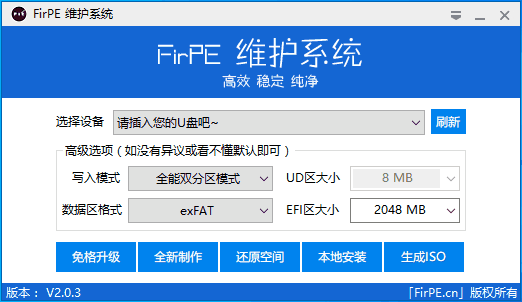
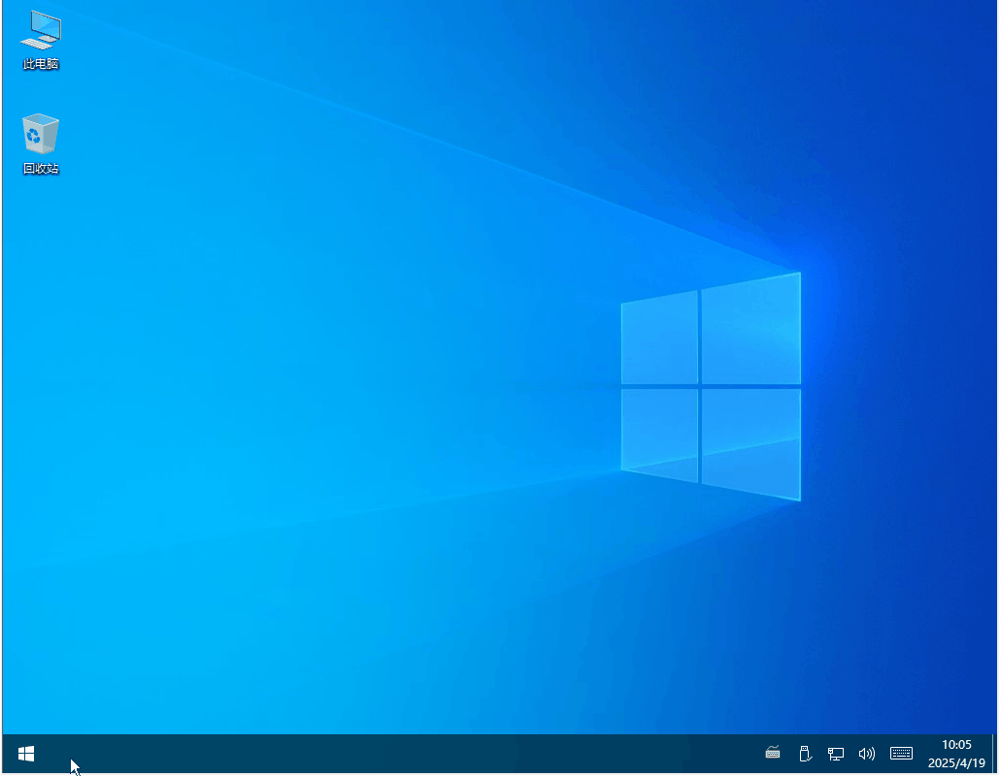
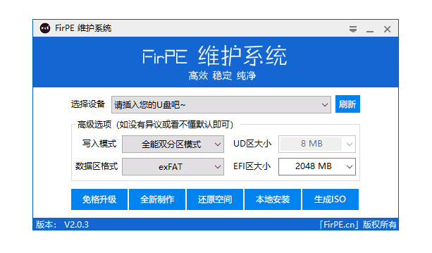

# 第一章：如何安装 FirPE 到 U 盘

## 1.1 全新制作 U 盘启动盘

### 适用场景

- 首次使用 FirPE
- U 盘存在不可修复错误
- 需要彻底清除旧数据

### 写入模式配置指南

> [!NOTE] 场景化建议
>
> - 普通用户：**双分区模式**（平衡安全性与易用性）
> - 极客玩家：**Ventoy 混合模式**（自由加载多系统镜像）
> - 古董设备：**三分区模式**（支持 2010 年前 Legacy 设备）

#### 单分区模式

单分区是将 WinPE 文件直接存放在用户数据分区中，用户数据分区可以被任意访问和修改，安全性较低，且由于 WinPE 启动要求 FAT32 文件系统，限制了用户数据分区的文件大小不能超过 4GB，因此该模式适用于 2GB 及以下容量的 U 盘。

**适用场景**

- 2GB 及以下容量 U 盘
- 扩容盘

**优缺点**  
✅ 简单易用  
❌ 安全性低  
❌ FAT32 文件系统限制（单文件 ≤4GB）

**分区结构**

  

    数据区、EFI区
  

#### 双分区模式

双分区将用户数据分区和 WinPE 分区分别独立，用户数据分区可以存储大于 4GB 的文件，WinPE 分区可以保证启动 U 盘的兼容性和稳定性。

**适用场景**

- 需存储大文件且保证兼容性

**优缺点**  
✅ 数据分区支持 NTFS/exFAT（突破 4GB 限制）  
❌ 老旧主板 Legacy 启动支持有限

**分区结构**

  

    数据区
  

  

    EFI 区
  

#### 三分区模式

三分区是在双分区基础上额外创建了一个 UD 引导分区，它可以增强启动 U 盘在老式电脑（约十年前左右）上的适应性。但是随着技术的发展，这些电脑已经不适合人们的生活需求，也不再需要进行维护。另一方面，UD 分区也有一些缺点，如占用 U 盘空间、增加制作难度、降低读写速度等。因此三分区的意义也逐渐减弱，除非有特殊的需求。

**适用场景**

- 支持 2010 年前旧设备维护（逐渐淘汰）

**优缺点**  
✅ 增强老旧设备兼容性  
❌ 占用空间/制作复杂/读写速度降低

**分区结构**

  

    

      UD 区
    

    

      数据区
    

    

      EFI 区
    

  

#### Ventoy 官方模式

Ventoy 是一种启动盘开源工具。无需反复地格式化 U 盘，你只需要把 ISO/WIM/IMG/VHD(x)/EFI 等类型的文件直接拷贝到 U 盘里面就可以启动了，无需其他操作。Ventoy 会在启动时显示一个菜单来供你进行选择。

**适用场景**

- 多系统启动测试/频繁更换镜像

**优缺点**  
✅ 免格式化直接加载 ISO/WIM/IMG 文件  
❌ 部分电脑兼容性不佳

**分区结构**

  

    数据区
  

  

    Ventoy 区
  

#### Ventoy 混合模式

在 Ventoy 基础上增加 EFI 分区，兼具灵活性和兼容性。

**适用场景**

- 极客用户（需同时兼容 UEFI + 特殊硬件）

**优缺点**  
✅ 最佳兼容性  
✅ 支持 Secure Boot  
❌ 分区结构复杂

**分区结构**

  

    数据区
  

    

    Ventoy 区
  

  

    EFI 区
  

### 专项配置指南

#### 数据区格式

> [!NOTE] 场景化建议
>
> - 普通用户：**exFAT**（最适合 U 盘）
> - 特殊需求：**NTFS**（Windows 专用）

| 文件系统 | 兼容性                       | 文件/分区限制                   | 高级功能                     | 优缺点                                        | 推荐场景                |
| -------- | ---------------------------- | ------------------------------- | ---------------------------- | --------------------------------------------- | ----------------------- |
| FAT32    | ⭐⭐⭐ （Win/Mac/游戏机） | 🔸 单文件 ≤4GB 🔸 分区 ≤32GB | ❌ 压缩/加密 ❌ 权限/日志 | ✅ 广泛兼容旧设备 ❌ 安全性低/功能缺失     | 老旧设备/小文件跨平台   |
| exFAT 🌟 | ⭐⭐ （Win/Mac/安卓）     | 🔹 无限制                       | ❌ 压缩/加密 ❌ 权限/日志 | ✅ 大文件支持 ✅ 闪存优化 ❌ 无断电保护 | 移动存储/大文件通用     |
| NTFS     | ⭐ （Win 读写/Mac 只读）  | 🔹 无限制                       | ✅ 压缩/加密 ✅ 权限/日志 | 🔹 Win 首选 ✅ 数据安全 ❌ 设备兼容性差 | Windows 系统/重要数据盘 |

#### EFI 区大小

用于存放 WinPE 相关数据的分区容量，一般情况下保持默认，如有需要也可适当增加空间以适应后续的升级。

#### UD 区大小（仅三分区模式可选）

用于存放 Legacy 引导时的引导菜单文件，FirPE 使用简化三分区模式（即 UD 引导区跳转到 EFI 引导菜单，UD 区不存放 WinPE 内核文件），所以 UD 区通常设置 8MB 即可。

### 操作步骤

> [!CAUTION]
>
> - 此操作会将 U 盘中的所有数据清除，请提前备份 U 盘中的资料，防止数据丢失！
> - 质量低劣/仿冒的 U 盘制作启动盘成功率和启动稳定性将会大幅降低！

> [!NOTE]
>
> - 如果启动盘制作完成后没有盘符，请右键「此电脑」-「管理」-「磁盘管理」，在磁盘列表中找到 U 盘数据区，右键-「更改驱动器号和路径」-「增加」-确定。
> - Windows 10 1703 起原生支持 U 盘多分区，故启动盘制作后会显示多个分区（Windows 10 以下版本系统中默认隐藏）。如有隐藏需求可在`菜单-制作选项`中，勾选`隐藏EFI分区`。

1. 将 U 盘插入到电脑中：

   

2. 打开 FirPE 程序，选择所需设置（一般默认设置），点击「全新制作」按钮制作启动盘
   

## 1.2 免格式化升级启动盘

### 适用场景

- 保留 U 盘数据，更新/降级 WinPE 版本
- 修复启动盘

### 操作步骤

1. 将已制作过 WinPE 的启动盘插入到电脑中：

   

2. 打开 FirPE 程序，点击「免格升级」按钮升级启动盘。

   

## 1.3 还原 U 盘启动盘

### 适用场景

清除 U 盘中的 WinPE 系统，恢复为普通存储盘。

### 操作步骤

1. 将已制作过 WinPE 的启动盘插入到电脑中：

   

2. 打开 FirPE 程序，点击「还原空间」按钮清除启动盘。

   

# 第二章：如何安装 FirPE 到本地系统

## 2.1 安装 FirPE 到本地系统

> [!NOTE]
>
> - 强烈建议通过 U 盘 等外部介质启动，避免写入本地硬盘进行系统维护引发的系统崩溃。
> - WinPE 安装在本地系统在系统重装后无法保留，因为 WinPE 需要建立系统引导菜单，而重装后即便 WinPE 文件得到保留但 WinPE 的系统引导也会丢失，造成无法正常使用本地安装的 WinPE。

1. 打开 FirPE 程序，点击「本地安装」按钮将 WinPE 安装到本地系统。
   
2. 重启系统后，将在系统引导菜单项中看到 WinPE 引导菜单
   

## 2.2 卸载本地系统 FirPE

1. 打开「开始菜单」，点击「FirPE 维护系统」-「卸载」

# 第三章：如何生成 ISO 镜像文件

### 适用场景

制作 WinPE 镜像用于虚拟机或刻录光盘

### 操作步骤

> [!NOTE]
>
> - Ventoy 用户可直接将 ISO 生成到 U 盘，减少复制 ISO 文件的步骤，同时将自动释放个性化接口目录
> - 随 ISO 生成后会有“个性化目录接口.exe”程序，其作用是自定义 FirPE，您可在制作 U 盘启动盘后运行此程序，选择 U 盘分区（注意二级目录无效）。如需虚拟机测试等可将此文件解压后复制到 ISO 文件内。

1. 打开 FirPE 程序，点击「生成 ISO」按钮。
2. 选择保存路径，自定义镜像名称（如 FirPE_V2.0.3.iso）。
3. 点击确定，等待完成即可。

   

<!--
# 第四章：如何利用手机制作 U 盘启动盘

### 适用场景

- 没有可以正常使用电脑
- 仅适用于安卓系统（无需 Root 权限）

### 操作步骤

1. 下载 [EtchDroid](https://github.com/etchdroid/etchdroid/releases) 并安装
2. 下载 img 格式的 WinPE 镜像，在官网有提供下载。
3. 打开 EtchDroid，选择“写入原始镜像或 ISO”，然后选择下载的 WinPE img 镜像。
4. 将 U 盘通过 OTG 连接接入手机，您应当可以看到您的 U 盘出现在列表中（可能是黑字显示，但后面序号可以帮助您判断）。
5. 允许访问 U 盘后，请保持默认设置，然后就可以开始写入 U 盘了。您可以在通知部分看到写入进度。写入完成后，即可拔下 U 盘。但需要注意，写入之后将只能利用 1GB 的空间。
6. 如需要将剩余空间扩展为可用空间，需要在进入 PE 后使用 DiskGenius 扩大分区大小。
   
-->
