# 如何使用启动盘进入 WinPE？

在制作好 FirPE 启动盘后，通过以下步骤即可进入 WinPE 系统环境。

## 前提准备

- 已用 FirPE 写入器将 FirPE 镜像写入 U 盘，并成功制作启动盘。
- 目标电脑支持 BIOS（Legacy）或 UEFI 启动，并可从 USB 设备启动。
- 缺少 SSE 4.2 指令集 的机器可进入 Win03PE。

## 插入启动盘

1. 将制作好的启动盘插入目标电脑的 USB 接口（建议插在后置 USB 接口以免供电不足）。
2. 确保 U 盘已被正确识别。

## 进入启动菜单

1. 重启电脑后，在开机自检（POST）画面出现时，连续按下启动菜单热键。

> [!NOTE]
>
> - 不同的硬件，进入 BIOS 的快捷键不同：
>   - **戴尔 (Dell)**、**联想 (Lenovo)**、**华硕 (ASUS)**、**宏碁 (Acer)** 通常是 `F2` 键。
>   - **惠普 (HP)** 通常是 `F10` 键。
>   - **MSI (微星)** 通常是 `Delete` 键。
>   - ...

2. 在启动设备列表中选择你的 U 盘（通常以品牌名或 “USB HDD” 标识）。

