> [!IMPORTANT]
>
> * ① 本文是对 https://massgrave.dev 和 https://firpe.cn/ 网站中相关操作的详细说明！！！
> * ② 在有条件的基础上，请尊重版权（购买正版，即：给微软打钱）！！！
> * ③ 在有条件的基础上，请给 [PE 作者](https://firpe.cn/sd/donate) 购买一杯咖啡☕！！！！


# 第一章：下载 Windows 和 Office

## 1.1 概述

* 该网站上提供的所有下载链接均指向正版文件。

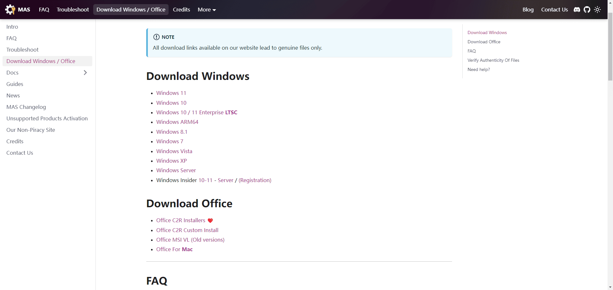

## 1.2 下载 Widows

* ① 点击[下载链接](https://massgrave.dev/windows_11_links)：

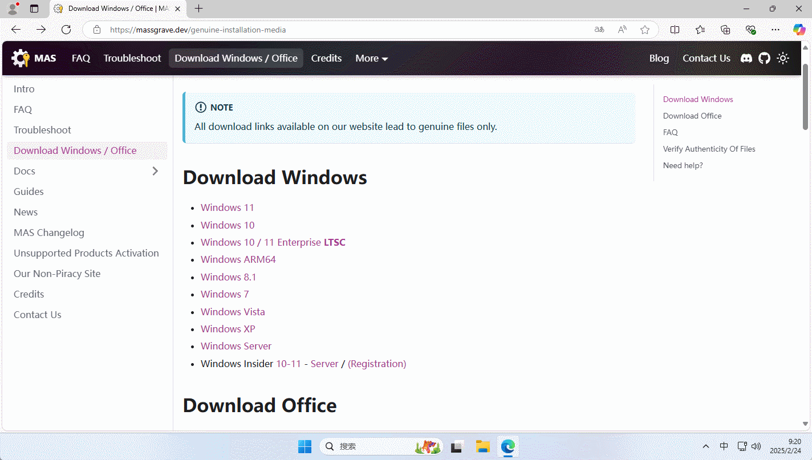

* ② 下载指定语言版本的操作系统，如：[简体中文](https://drive.massgrave.dev/zh-cn_windows_11_business_editions_version_24h2_x64_dvd_5f9e5858.iso)：

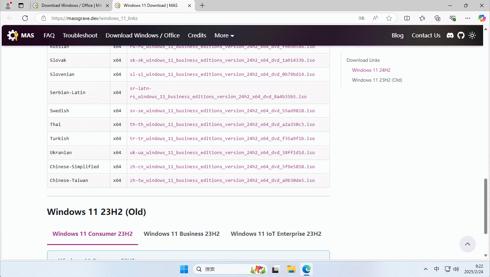

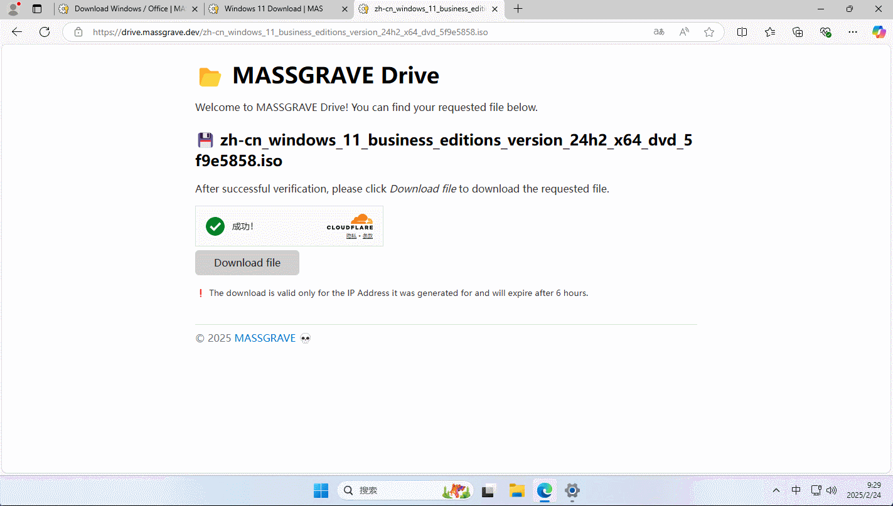

* ③ 查看下载的 Windows 系统镜像：

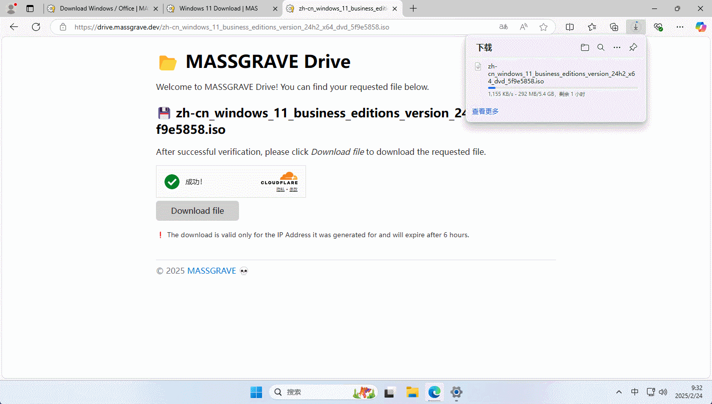

## 1.3 下载 Office

* ① 点击[下载链接](https://gravesoft.dev/office_c2r_links)：

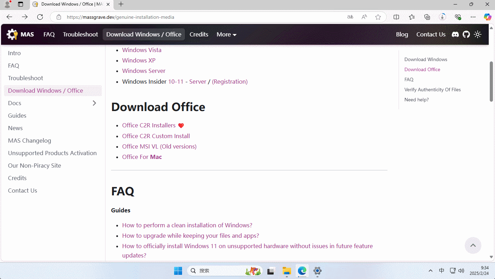

* ② 下载指定语言版本的 Office，如：[简体中文](https://c2rsetup.officeapps.live.com/c2r/download.aspx?ProductreleaseID=ProPlus2024Retail&platform=x64&language=zh-cn&version=O16GA)：

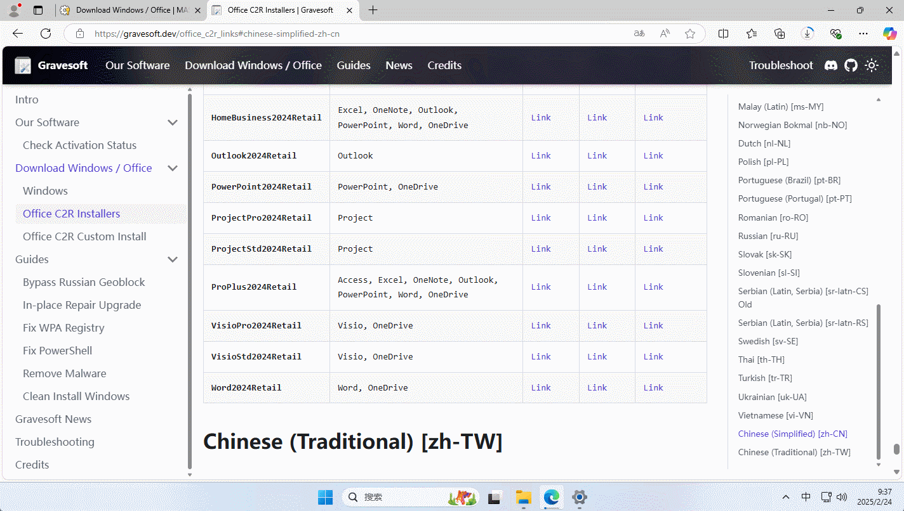

* ③ 查看下载的 Office 安装包：

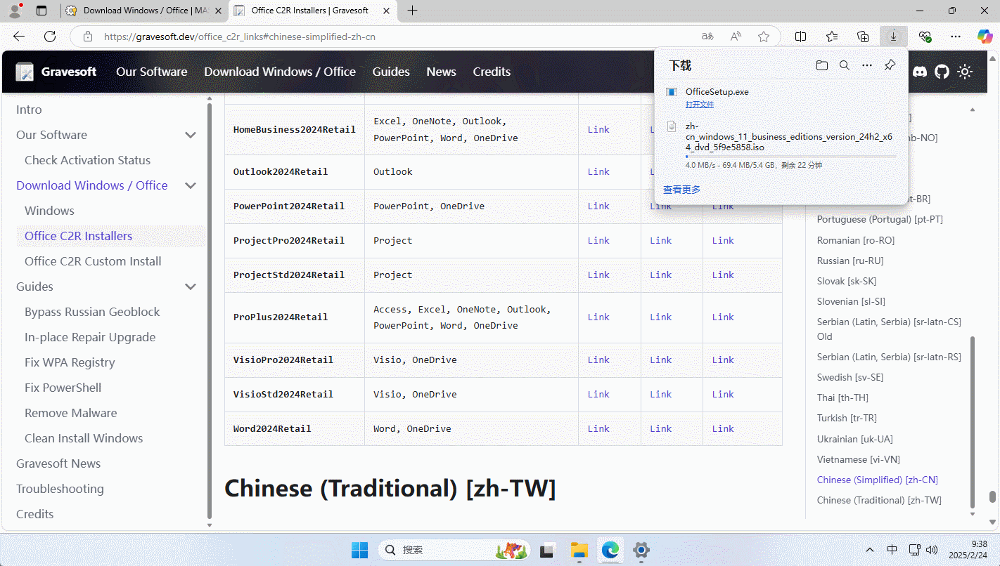


# 第二章：制作 PE

## 2.1 概述

* 所谓的 PE 就是预安装环境，它是一种轻量级的操作系统环境，通常用来进行系统安装、修复或备份等操作。

> [!NOTE]
>
> 需要一个 U 盘来制作 PE 系统！！！

* 在 `U 盘`中安装 PE 系统后，可以通过 U 盘启动电脑，进入 PE 环境进行操作：系统修复、数据恢复以及磁盘分区等。

## 2.2 安装 PE 软件

* ① 点击进入 [PE](https://firpe.cn/) 官网：


* ② 下载 PE 软件：

> [!NOTE]
>
> 如果你觉得下面的方式麻烦，也可以点击[链接](https://drive.google.com/file/d/1gE9VJIjy7jygE0wHxRZgKj8PAGJj0pEs/view?usp=sharing)进行下载，只是需要科学上网！！！

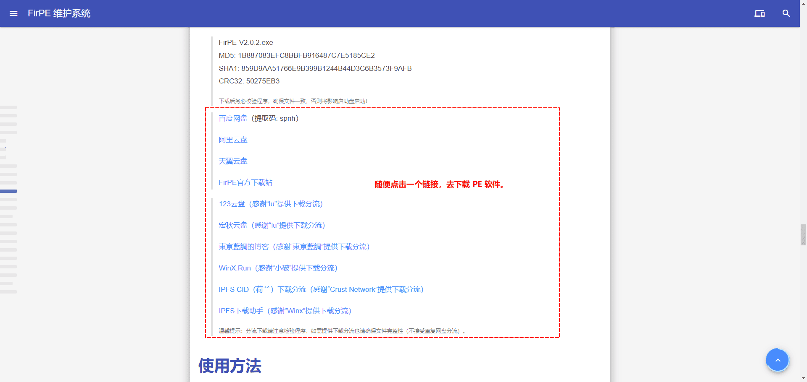

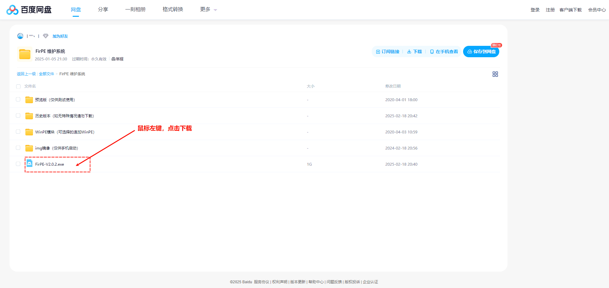

* ③ 查看下载的 PE 软件：

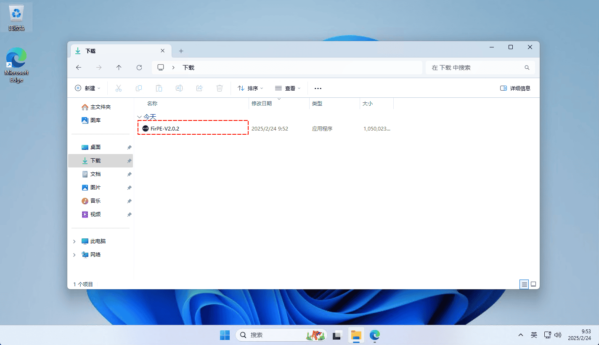

## 2.3 制作 PE

* ① 将事先准备好的 U 盘插入到电脑中：

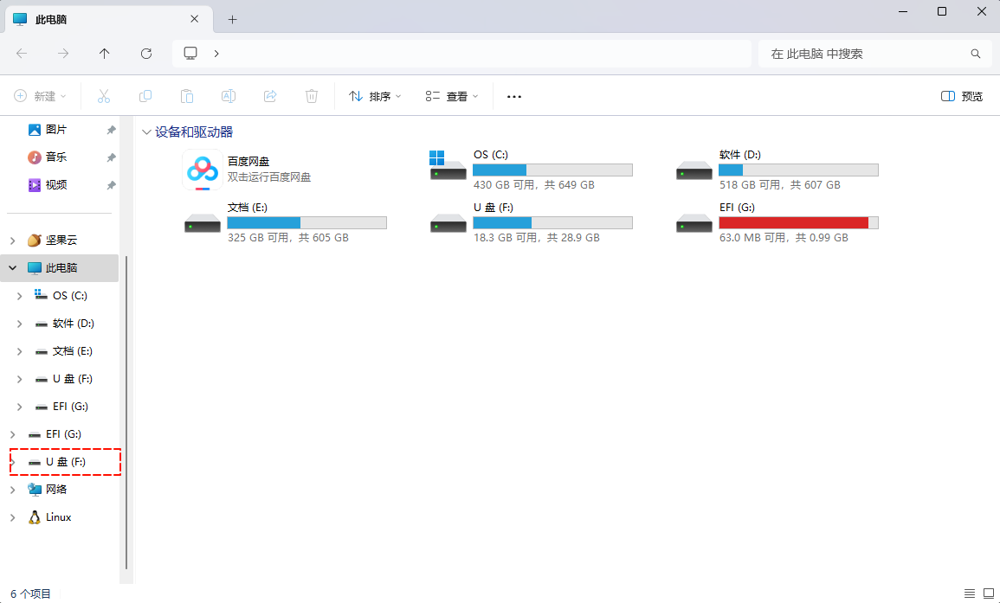

* ② 使用上面下载的 PE 软件对 U 盘进行进行`全新制作`，即：制作 PE：

> [!CAUTION]
>
> 此操作会将 U 盘中的所有数据抹除，请提前备份 U 盘中的资料，防止数据丢失！！！


* ③ 将刚才下载的 Windows 镜像以及 Office 安装包复制到 U 盘中：

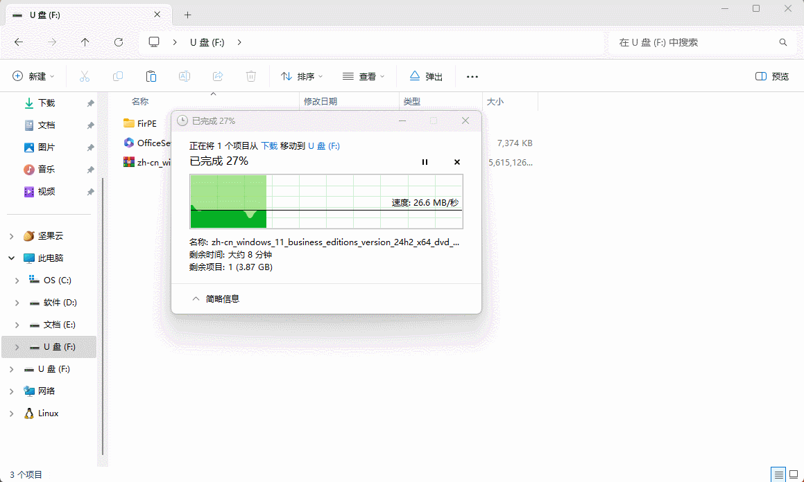


# 第三章：安装 Windows 和 Office

## 3.1 安装 Windows

* ① 将刚才制作好的 PE 插入到电脑上，并重启系统，以便引入 BIOS：

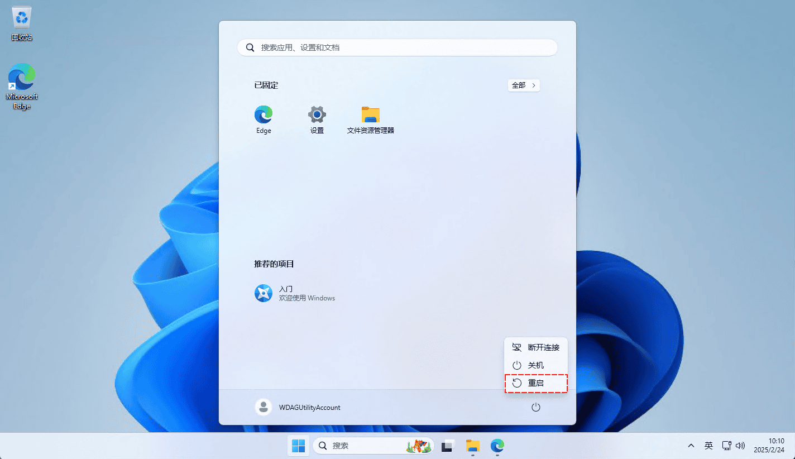

* ② 进入 PE （硬件不同，进入的方式不同）：

> [!NOTE]
>
> * ① 不同的硬件，进入 BIOS 的快捷键不同：
>   * **戴尔 (Dell)**、**联想 (Lenovo)**、**华硕 (ASUS)**、**宏碁 (Acer)** 通常是 `F2` 键。
>   * **惠普 (HP)** 通常是 `F10` 键。
>   * **MSI (微星)** 通常是 `Delete` 键。
>   * ...
> * ② 当重启系统之后，黑屏上会提示：如何进入 BIOS ，此时需要快速的不停地按指定的快捷键！！！
> * ③ 本人使用的是 `VMWare WorkStation Pro 17`  来模拟电脑，和实际裸机安装操作系统的方式差不多！！！

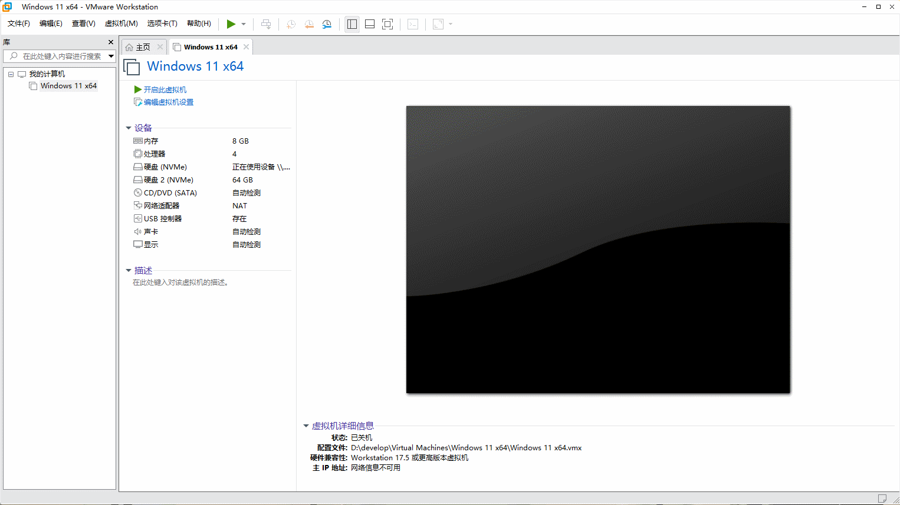

* ③ 使用 PE 自带的分区软件对磁盘进行分区：

> [!CAUTION]
>
> * ① 分区的主要目的就是写入文件系统，会将磁盘的文件抹除，需要谨慎操作！！！
> * ② 如果之前硬盘已经有操作系统了，即：第二次安装操作系统，此时也可以不对硬盘进行分区，使用之前的分区。
> * ③ Win11 不支持 MBR 分区格式，请选择 GPT 分区格式！！！

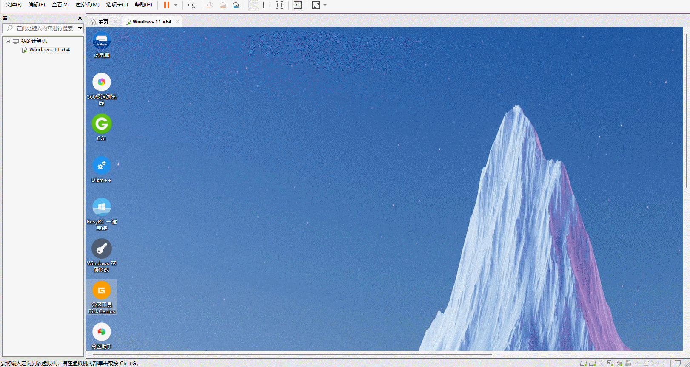

* ④ 使用 PE 自带的软件进行操作系统的安装：

> [!CAUTION]
>
> * ① 需要选择 U 盘中的 Windows 镜像作为安装文件！！！
>
> ::: details 点我查看
>
> 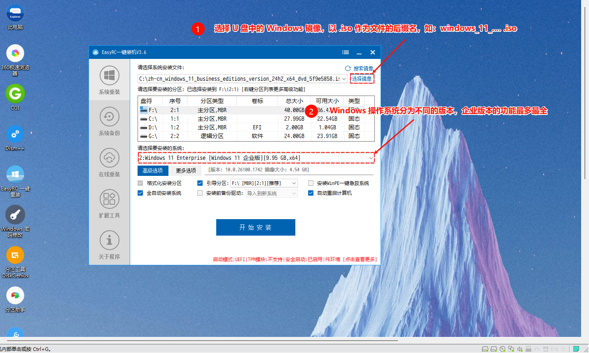
>
> :::
>
> * ② 安装的目的是分区之后的硬盘，而不是 PE 所在的 U 盘！！！
>
> ::: details 点我查看
>
> 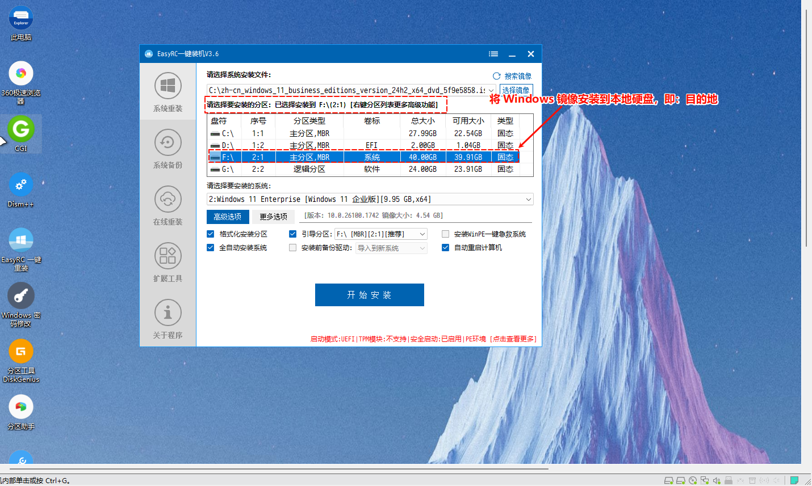
>
> :::

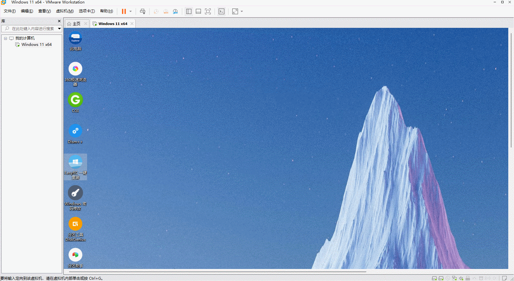

* ⑤ 漫长的等待...，操作系统终于安装到本地硬盘上：

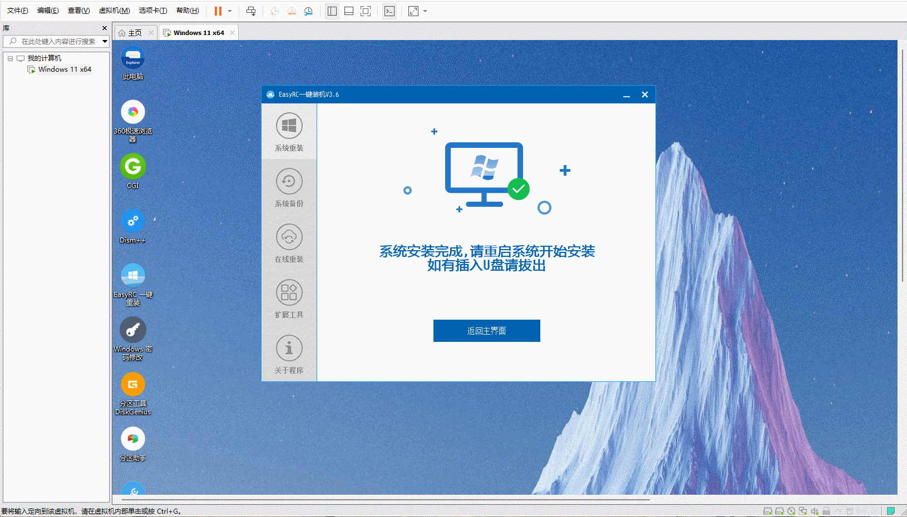

* ⑥ 重启 PE 中的操作系统，进入 BIOS 中，并选择 `Windows Boot Manager`：

> [!NOTE]
>
> * ① 不同的硬件，进入 BIOS 的快捷键不同：
>   * **戴尔 (Dell)**、**联想 (Lenovo)**、**华硕 (ASUS)**、**宏碁 (Acer)** 通常是 `F2` 键。
>   * **惠普 (HP)** 通常是 `F10` 键。
>   * **MSI (微星)** 通常是 `Delete` 键。
>   * ...
> * ② 当重启系统之后，黑屏上会提示：如何进入 BIOS ，此时需要快速的不停地按指定的快捷键！！！

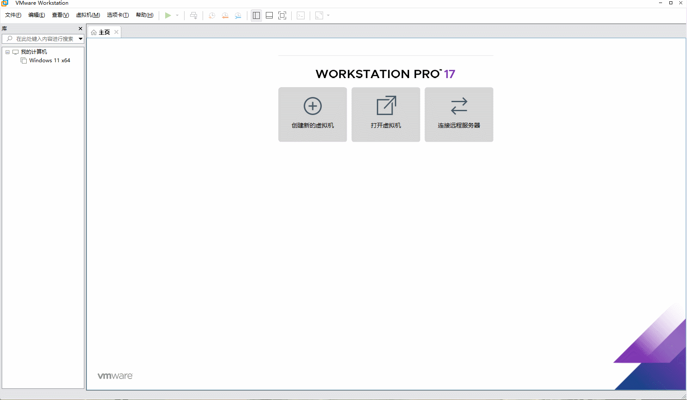

* ⑦ 开始 Windows 的安装...：

> [!NOTE]
>
> 中间可能会多次重启，不要管它，让其自行操作！！！
>
> ::: details 点我查看
>
> 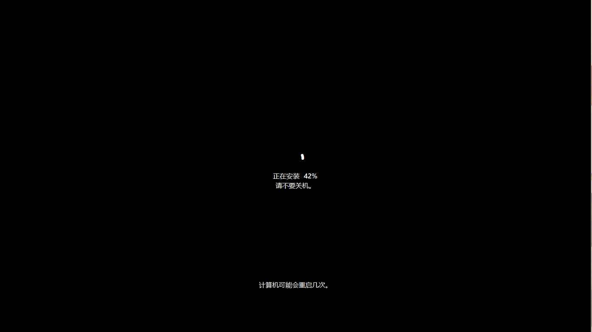 
>
> :::

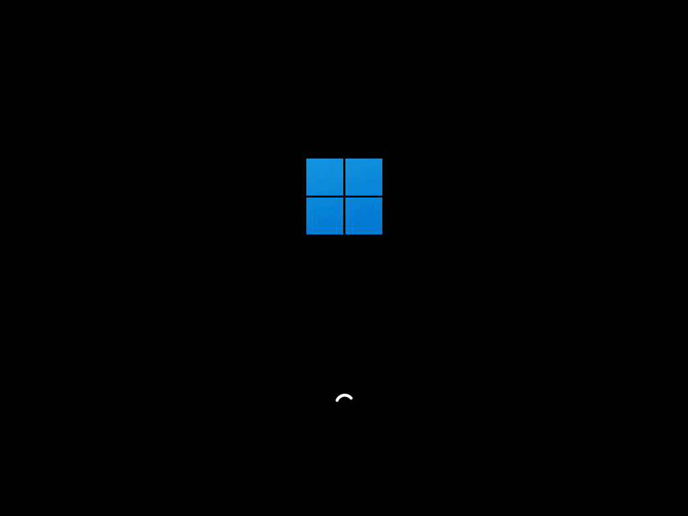

* ⑧ 进行 Windows 系统的设置：

> [!NOTE]
>
> Win11 默认是需要联网的，我们也可以使用本地账户登录，步骤如下：
>
> * ① 使用 Shift + F10 调用 cmd 窗口：
>
> ::: details 点我查看
>
> 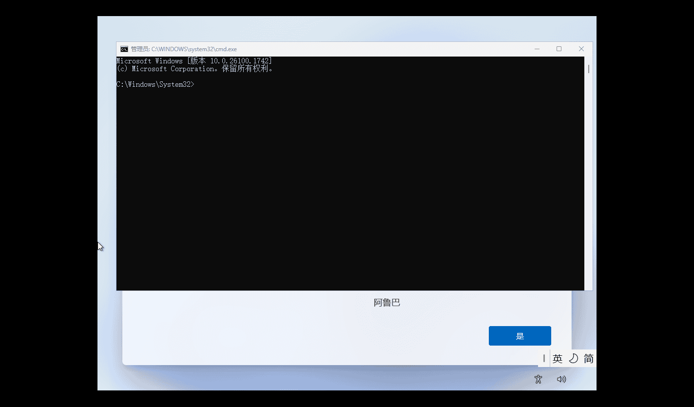
>
> :::
>
> * ② 在 cmd 窗口，输入如下的命令，并按回车：
>
> ```cmd
> oobe\bypassnro.cmd
> ```
>
> ::: details 点我查看
>
> 
>
> :::
>
> * ③ 等待重启，重启之后，就可以使用本地账户登录：
>
> ::: details 点我查看
>
> 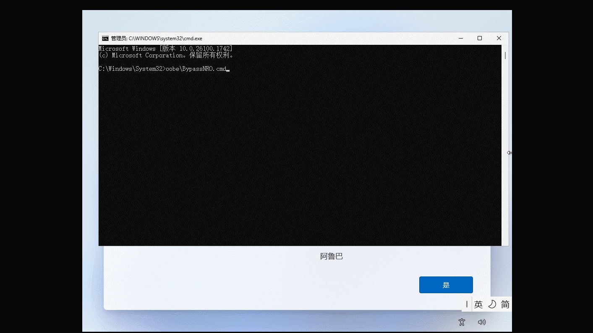
>
> :::

> [!NOTE]
>
> 根据个人配置进行设置，下面是我随便填写的，每个人不一样！！！


## 3.2 安装 Office

* ① 找到 U 盘中的 Office 的安装包，并复制到桌面上：

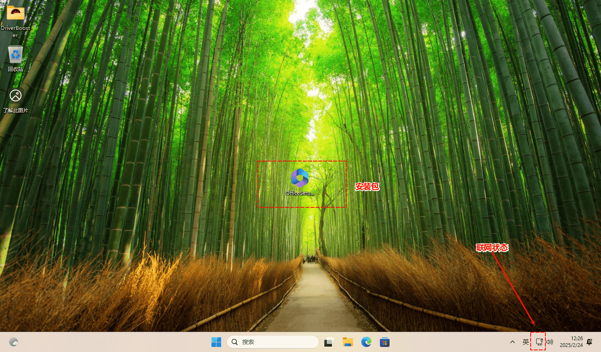

* ② 鼠标双击，下一步安装：

> [!NOTE]
>
> 安装 Office 的时候，需要联网！！！

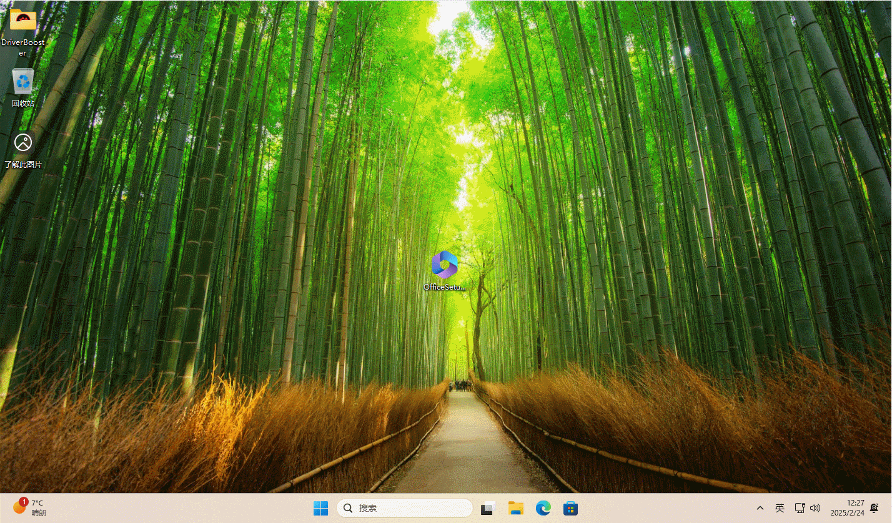

* ③ Office 安装完成：


# 第四章：激活 Windows 和 Office

## 4.1 概述

* 激活 Windows 产品的，有 HWID、Ohook、TSforge、KMS38 和在线 KMS 激活方法，本次使用 TSforge 。

## 4.2 TSforge 激活

* ① 右键单击 Windows 开始菜单并选择 PowerShell ：

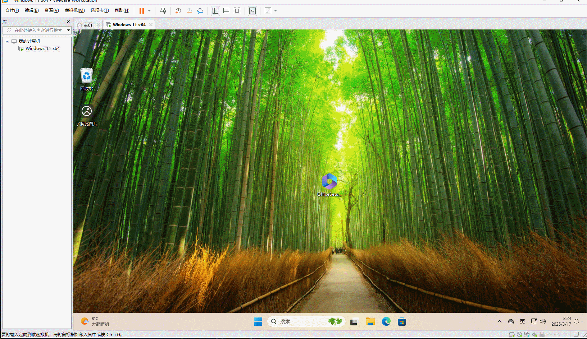

* ② 执行如下命令：

> [!NOTE]
>
> 需要联网，以便下载激活脚本！！！

```powershell
irm https://get.activated.win | iex
```

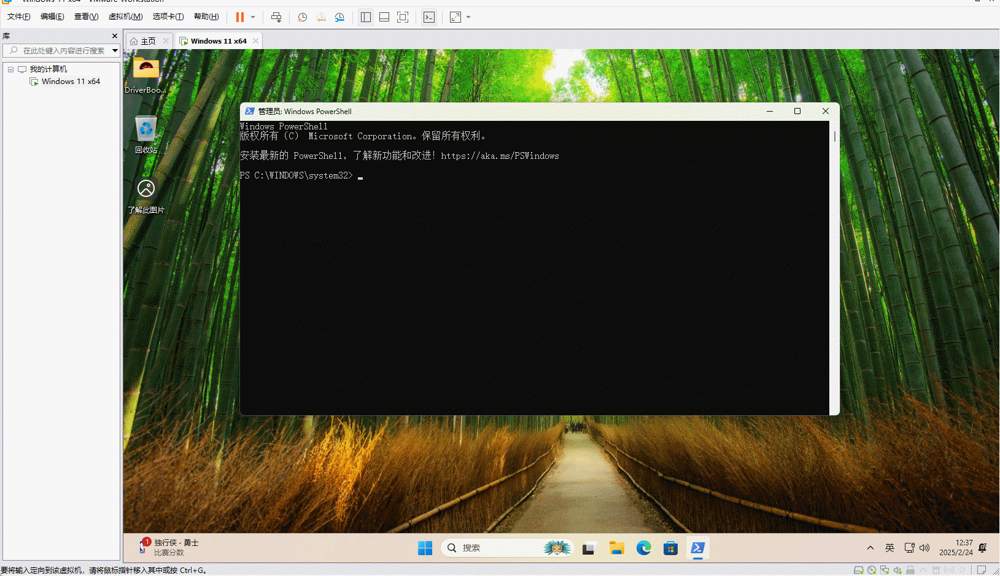

* ③ 开始激活：

> [!NOTE]
>
> * ① 键盘选择 `3` ，即：TSforge  激活方式。
> * ② 键盘选择 `5` ，即：激活所有本地安装的 Windows 产品。

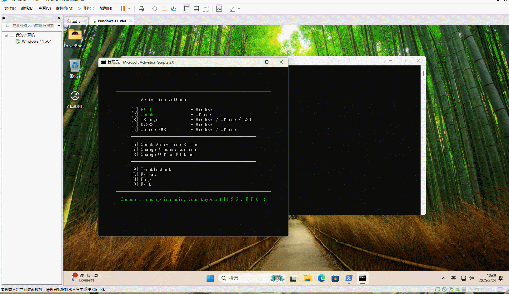

* ④ 查看是否激活成功：

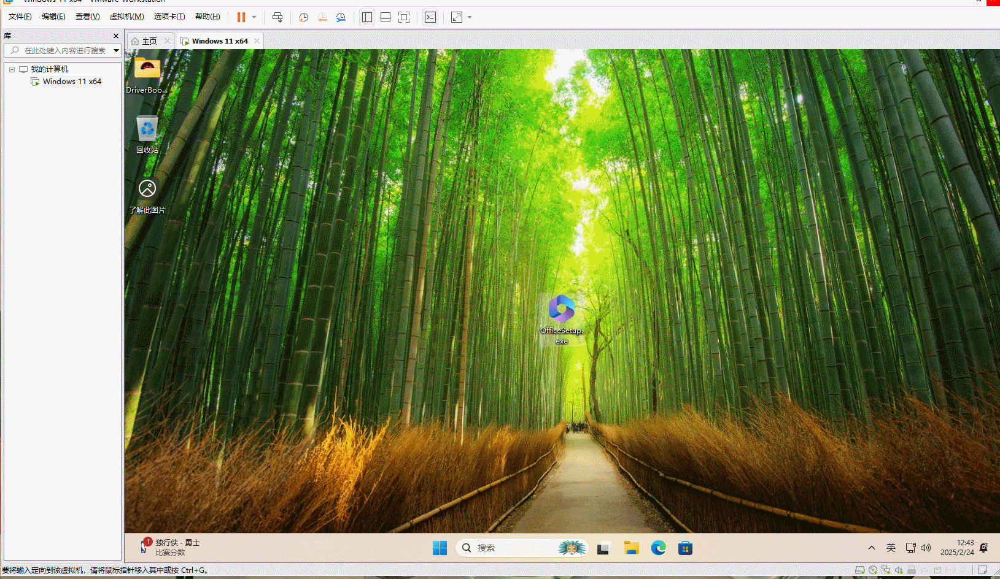
